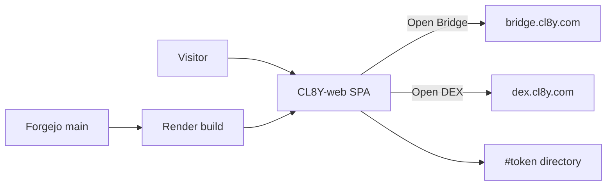

# CL8Y-web architecture

Marketing SPA for **CL8Y Bridge**, **CL8Y DEX**, and the CL8Y utility token
(`https://cl8y.com`). Product IA, copy, and host headers stay in
[`PROJECT_GUIDE.md`](../PROJECT_GUIDE.md), [`src/content/invariants.ts`](../src/content/invariants.ts),
and the skills listed in [`AGENTS.md`](../AGENTS.md). This file is the short
system map plus merge-gate pointer. Do not duplicate visitor copy here.

## Runtime

| Layer | Choice |
|-------|--------|
| App | Vite + React static SPA. No SSR. Prerender for OG/blog. |
| Host | Render static (`render.yaml`). Clickjacking: `X-Frame-Options: DENY`, `CSP frame-ancestors 'none'`. |
| Products | Bridge / DEX are **exits** (`src/data/products.ts`). Token directory is `#token`. |
| Blog worker | Not this SPA. See `cl8y-research`. |



## Forgejo merge gate {#forgejo-merge-gate}

Catch-all `CODEOWNERS` (`.* @code/maintainers`) is **not** a merge gate.
Official review requests must not be planted on every change.

**Four CODEOWNERS search paths.** Forgejo loads the first existing file among
`CODEOWNERS`, `docs/CODEOWNERS`, `.gitea/CODEOWNERS`, and `.forgejo/CODEOWNERS`
(Go-regexp, not GitHub globs; `.gitea/` remains in the walk; `.forgejo/` added
in forgejo#8773). Host [INVARIANTS §8](https://git.cl8y.com/PlasticDigits/cl8y-forgejo/src/branch/main/docs/INVARIANTS.md)
(on forgejo `main` via [#50](https://git.cl8y.com/PlasticDigits/cl8y-forgejo/pulls/50))
still lists three; this SPA still names `.gitea/` because Forgejo will plant
from it. After land, `test -f` fails on all four. Tracked basename
`CODEOWNERS` is none — extra check, not a substitute for naming `.gitea/`.

**Protection GET (do not PATCH from this repo).** Live
`GET /api/v1/repos/code/CL8Y-web/branch_protections` for `rule_name == "main"`
(`updated_at` **2026-09-21T07:28:21Z**; re-read 2026-09-21 still equal). A
green scanner is not proof of these rows.

| Flag | Required value |
|------|----------------|
| `enable_push` | `false` (no direct `main`) |
| `enable_status_check` | `true` |
| `status_check_contexts` | **equal** `["ci/woodpecker/pr/woodpecker"]` (not subset) |
| `required_approvals` | `0` |
| `block_on_official_review_requests` | `false` |
| `block_on_rejected_reviews` | `true` |

Never `force_merge`. Never fake commit statuses. This ticket **deletes the
planted-request file**; it does not PATCH protection.

**Merge/close of [#14](https://git.cl8y.com/code/CL8Y-web/issues/14).** Host
already requires that Woodpecker context. This tree has no `.woodpecker.yaml`
/ `.woodpecker/` (`de05ed0` statuses empty). File-delete + docs + tests may
complete on the product-PR **branch**. They do **not** merge or close #14
until `ci/woodpecker/pr/woodpecker` posts on that tip. Do not add a pipeline
in the CODEOWNERS diff. No CL8Y-web Woodpecker iid exists as of 2026-09-21
(issue 15 404); enablement is a named future CI issue. #14 stays open until
that context greens.

Decision, slices, tests, rollback: [ADR 0001](./adr/0001-remove-catchall-codeowners.md)
([#14](https://git.cl8y.com/code/CL8Y-web/issues/14)). Host write-up:
[cl8y-forgejo#48](https://git.cl8y.com/PlasticDigits/cl8y-forgejo/issues/48)
and forgejo PR **#50** (`docs/INVARIANTS.md` on `main`). Deploy / spend /
custody / policy expansion: [agent-control #297](https://git.cl8y.com/PlasticDigits/cl8y-agent-control/issues/297)
— this ticket is none of those. Sister CAC autoland predicates are **#429**,
not this SPA. Product PR #14 (or a successor) is the land vehicle;
`cac-design-issue-14` is transport only.

## Directory (agents)

```
src/app/           routes + homepage
src/features/      current IA sections (do not remount RETIRED_HOMEPAGE_MODULES)
src/data/          products, token directory, copy, links
src/content/       typed marketing invariants + tests
docs/adr/          versioned decisions
render.yaml        static host + clickjacking headers
```

## ADRs

| ADR | Topic |
|-----|--------|
| [0001](./adr/0001-remove-catchall-codeowners.md) | Remove catch-all CODEOWNERS ([#14](https://git.cl8y.com/code/CL8Y-web/issues/14)) |
