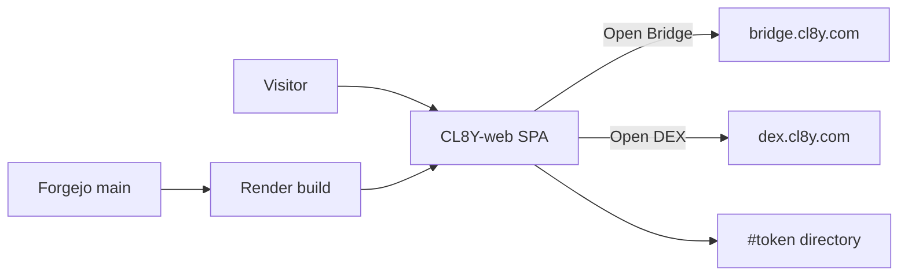

# CL8Y-web architecture

Marketing SPA for **CL8Y Bridge**, **CL8Y DEX**, and the CL8Y utility token
(`https://cl8y.com`). Product IA, copy, and host headers stay in
[`PROJECT_GUIDE.md`](../PROJECT_GUIDE.md), [`src/content/invariants.ts`](../src/content/invariants.ts),
and the skills listed in [`AGENTS.md`](../AGENTS.md). This file is the short
system map plus merge-gate pointer. Do not duplicate visitor copy here.

## Runtime

| Layer | Choice |
|-------|--------|
| App | Vite + React static SPA. No SSR. Prerender for OG/blog. |
| Host | Render static (`render.yaml`). Clickjacking: `X-Frame-Options: DENY`, `CSP frame-ancestors 'none'`. |
| Products | Bridge / DEX are **exits** (`src/data/products.ts`). Token directory is `#token`. |
| Blog worker | Not this SPA. See `cl8y-research`. |



## Forgejo merge gate {#forgejo-merge-gate}

Catch-all `CODEOWNERS` (`.* @code/maintainers`) is **not** a merge gate.
Official review requests must not be planted on every change.

**Merge gate (host policy from [cl8y-forgejo#48](https://git.cl8y.com/PlasticDigits/cl8y-forgejo/issues/48); do not weaken from this repo):**

1. No direct push to `main` (`enable_push=false`).
2. Required status `ci/woodpecker/pr/woodpecker`.
3. Never `force_merge`.
4. Keep `required_approvals=0`, `block_on_rejected_reviews=true`,
   `block_on_official_review_requests=false` (already rolled on the host).
   This ticket **deletes the planted-request file**; it does not PATCH protection.

Decision, slices, tests, rollback: [ADR 0001](./adr/0001-remove-catchall-codeowners.md)
([#14](https://git.cl8y.com/code/CL8Y-web/issues/14)). Host write-up:
[cl8y-forgejo#48](https://git.cl8y.com/PlasticDigits/cl8y-forgejo/issues/48)
and forgejo PR **#50** (`docs/INVARIANTS.md` + ADR 0003 item 8). A 404 on
forgejo `main` for that file does not mean the policy is missing. Deploy /
spend / custody / policy expansion: [agent-control #297](https://git.cl8y.com/PlasticDigits/cl8y-agent-control/issues/297)
— this ticket is none of those. Sister CAC autoland predicates are **#429**,
not this SPA.

This repo had **no** `.woodpecker.yaml` on `main` when #14 was filed. Adding a
pipeline is **not** ADR 0001. Missing CI statuses are a pre-existing host/CI
gap, not a reason to keep catch-all CODEOWNERS.

## Directory (agents)

```
src/app/           routes + homepage
src/features/      current IA sections (do not remount RETIRED_HOMEPAGE_MODULES)
src/data/          products, token directory, copy, links
src/content/       typed marketing invariants + tests
docs/adr/          versioned decisions
render.yaml        static host + clickjacking headers
```

## ADRs

| ADR | Topic |
|-----|--------|
| [0001](./adr/0001-remove-catchall-codeowners.md) | Remove catch-all CODEOWNERS ([#14](https://git.cl8y.com/code/CL8Y-web/issues/14)) |
